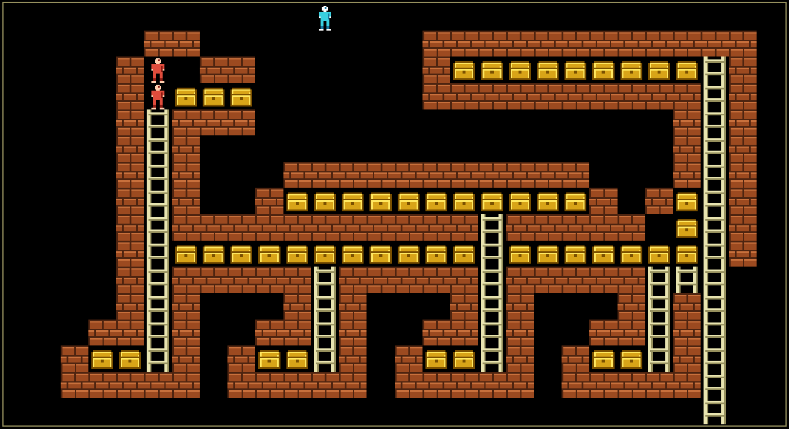
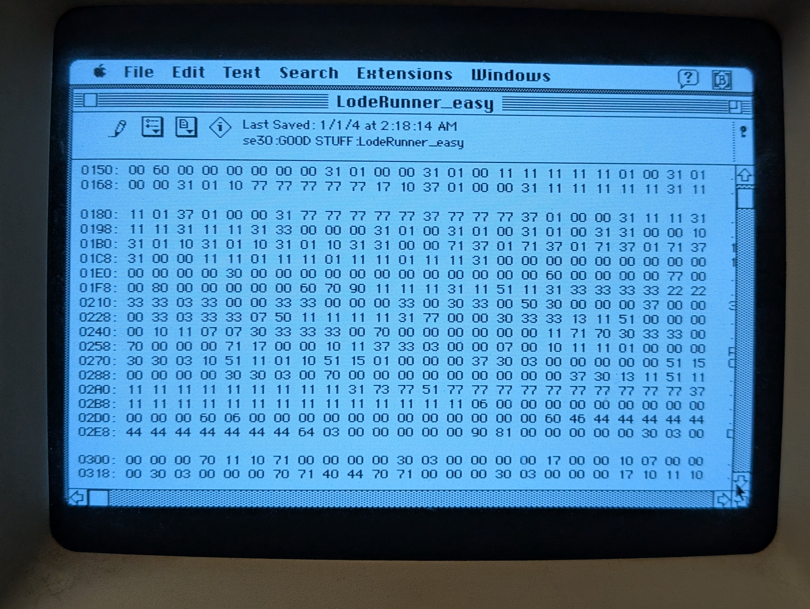

# Jim's Levels

[Click here to play the 86 Lode Runner levels I made when I was a kiddo.](https://jpivarski.github.io/jims-loderunner-levels/)

<!-- COPY HERE -->

## I didn't invent this game!

Just to be clear: this is [Lode Runner](https://en.wikipedia.org/wiki/Lode_Runner), a hit in 1983 that featured a level editor, spawned a community sharing user-designed levels, [magazine contests](https://cgwmuseum.org/galleries/index.php?year=1985&pub=2&id=21), [books of levels to copy](https://ndlsearch.ndl.go.jp/books/R100000002-I000001903930), and [competitions](https://note.com/cyborgmsx/n/n9c87c5cbef81).

**What you see above are _my_ levels, which I made when I was 10.** I was lucky enough to find my original floppy disks and have access to an old-enough computer, so I got the data by converting the game files to hexidecimal, photographing it, interpreting the hexidecimal with OCR, and then fixing the transcription errors. Fortunately, the files are very small.

## Lode Runner is awesome

It's like chess with reaction time. The architecture of a level forces you to plan how you're going to get all of the golds without getting eaten by the guards, and then implement it. You can't jump, and although you can shoot, you don't shoot the guards. You shoot the floor: to jump through it, to (temporarily) trap a guard, or to dig out some deeply buried gold. But think carefully, because you need a place to stand while digging.

The guards are idiots. They have an algorithm, but it only sometimes involves chasing you. Nevertheless, you need to learn their algorithm because they can carry gold, and you need to get it from them. In some levels, the gold is hidden in places that you can't get to, but you can kill the guards (by burying them and letting the ground swallow them up) to make them respawn, sometimes in the places where you need them.

Also, you fall faster than they do. That can be a part of the puzzle, too.

There's a lot to think about!

## Who owns Lode Runner? Is this site legal?

The original game was created by Douglas Smith and published by Brøderbund in 1983 ([full story](https://www.filfre.net/2020/12/lode-runner/)). The version I played was ported to the Apple Macintosh in 1984 by Glenn Axworthy. The copyright is now owned by [Tozai Games](https://global.tozaigames.com/), who created a new version, [Lode Runner Legacy](https://global.tozaigames.com/legacy/) ([Steam](https://store.steampowered.com/app/628660/Lode_Runner_Legacy/)), which includes the classic levels.

This website has none of the classic levels, only the ones that I designed, and the game engine is rewritten from scratch. It was inspired by [LodeRunner_TotalRecall](https://github.com/SimonHung/LodeRunner_TotalRecall) by Simon Hung, which has no license, but I didn't copy any code from it. The pixel art and sounds on this site are also original.

Game rules and algorithms are not copyrightable.

"Lode Runner" is a trademark of Tozai Games. This project is unaffiliated with and unendorsed by Tozai Games or any other rights holder.
